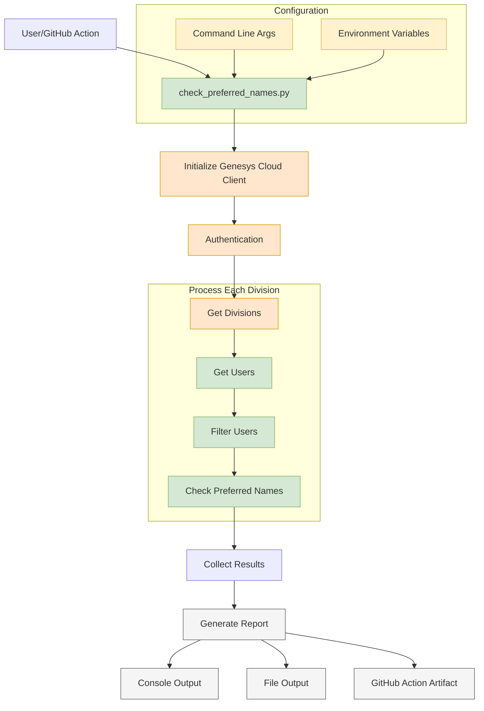

# Solution Design - Preferred Names Checker

## Overview
This document describes the design of the Preferred Names Checker solution, which identifies Genesys Cloud users whose preferred names are either empty or don't match their first names.

## Architecture
The solution follows a linear workflow with the following components:

1. **Entry Points**
   - Manual execution through command line
   - Automated execution through GitHub Actions
   - Environment variable or command-line configuration

2. **Core Components**
   - Authentication and API Client setup
   - Division retrieval and processing
   - User data collection and filtering
   - Report generation

3. **Output Methods**
   - Console logging
   - File output
   - GitHub Actions artifacts

## Workflow
1. **Initialization**
   - Parse command line arguments
   - Load environment variables
   - Set up logging

2. **Authentication**
   - Configure Genesys Cloud client
   - Authenticate using client credentials
   - Set up API endpoints

3. **Data Collection**
   - Retrieve all divisions (or specific division)
   - For each division:
     - Get all users
     - Filter users based on name criteria
     - Collect mismatched users

4. **Report Generation**
   - Summarize findings
   - Generate detailed report
   - Output to file/console

## Configuration
- **Required**:
  - Genesys Cloud Region
  - Client ID
  - Client Secret

- **Optional**:
  - Specific Division ID
  - Output File Path

## Error Handling
- Environment variable validation
- API error handling
- Data processing error handling
- File operation error handling

## Output Format
```
Users with Empty or Mismatched Preferred Names
===========================================

User ID: [id]
Full Name: [name]
First Name: [first_name]
Preferred Name: [preferred_name]
Email: [email]
Division: [division]
-------------------------------------------
```

## Technical Details
- **Language**: Python 3.9+
- **Main Dependencies**: 
  - PureCloudPlatformClientV2
  - logging
  - argparse

### Mermaid Diagram


The Mermaid diagram above shows the flow of the application with:
- Yellow boxes: Configuration components
- Green boxes: Processing components
- Orange boxes: Authentication and API operations
- Gray boxes: Output components
