# Email Blacklist Solution Design

## System Architecture

## Component Details

## Security and Authentication Flow

```mermaid
sequenceDiagram
    participant GH as GitHub Actions
    participant Script as Python Script
    participant Slack as Slack API
    participant Genesys as Genesys Cloud

    GH->>Script: Load Environment Secrets
    
    Script->>Slack: Initialize WebClient with Bot Token
    activate Slack
    Slack-->>Script: Verify Token & Scopes
    deactivate Slack
    
    Script->>Genesys: Initialize with Client ID/Secret
    activate Genesys
    Genesys-->>Script: Authenticate API Client
    deactivate Genesys
    
    loop Every 4 Hours
        Script->>Slack: Fetch Channel Messages
        activate Slack
        Slack-->>Script: Return Messages
        deactivate Slack
        
        Script->>Script: Extract & Validate Emails
        
        Script->>Genesys: Check Existing Blacklist
        activate Genesys
        Genesys-->>Script: Return Current Entries
        deactivate Genesys
        
        Script->>Genesys: Add New Entries
        activate Genesys
        Genesys-->>Script: Confirm Updates
        deactivate Genesys
    end
```

## Error Handling and Retry Logic

## Environment Configuration

Required environment variables and their purposes:

| Variable | Purpose | Service |
|----------|---------|----------|
| SLACK_BOT_TOKEN | Authentication token for Slack API | Slack |
| SLACK_CHANNEL_ID | Channel to monitor for email addresses | Slack |
| GENESYS_CLIENT_ID | Client ID for Genesys Cloud API | Genesys |
| GENESYS_CLIENT_SECRET | Client Secret for Genesys Cloud API | Genesys |
| GENESYS_REGION | Genesys Cloud region (e.g., us_east_1) | Genesys |
| GENESYS_DATA_TABLE_ID | ID of the blacklist data table | Genesys |

## Required Slack Bot Permissions

- channels:history
- channels:read

## Genesys Cloud Requirements

- Data Table Structure:
  - EmailAddress (String, Primary)
  - DateAdded (DateTime)
  
- API Permissions:
  - Architect > dataTables > GET, POST
  - Architect > dataTables > rows > GET, POST
