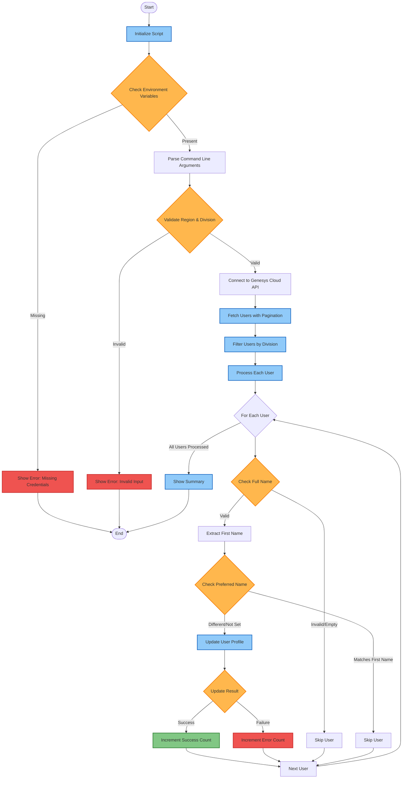

# Genesys Cloud Profile Name Updater - Logic Flow

## Process Flow Diagram

## Key Components

1. **Initialization**
   - Load environment variables
   - Parse command-line arguments
   - Validate required inputs

2. **API Connection**
   - Connect to Genesys Cloud
   - Authenticate using client credentials

3. **User Fetching**
   - Fetch users with pagination
   - Filter users by specified division

4. **User Processing**
   For each user:
   - Validate full name
   - Extract first name
   - Check current preferred name
   - Update if necessary

5. **Error Handling**
   - Environment variables missing
   - API connection failures
   - Invalid user data
   - Update failures

6. **Summary**
   - Total users processed
   - Successful updates
   - Skipped users
   - Errors encountered

## Environment Requirements

- `GENESYS_CLIENT_ID`
- `GENESYS_CLIENT_SECRET`
- `GENESYS_DIVISION_ID` (optional if provided via CLI)
- `GENESYS_REGION` (optional if provided via CLI)

## Command Line Arguments

- `--division-id`: Genesys Cloud Division ID
- `--region`: Genesys Cloud region (e.g., mypurecloud.de)
